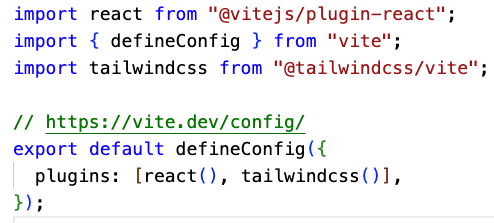

# Project Setup

1. create two folder frontend and backend
2. go to frontend `cd frontend`
   - type `npm create vite@latest`
   - press `Y` if asked to install
   - enter `.` in project name
   - select 'React` as framework from arrow key
   - select JavaScript from variant by arrow key
   - select ESLint by arrow key
   - select Yes and press enter
3. setup tailwind in react project
   - install tailwind by `npm install tailwindcss @tailwindcss/vite`
   - update vite.config.js as below image
     
   - remove all contents of index.css then write `@import "tailwindcss"` top of index.css
